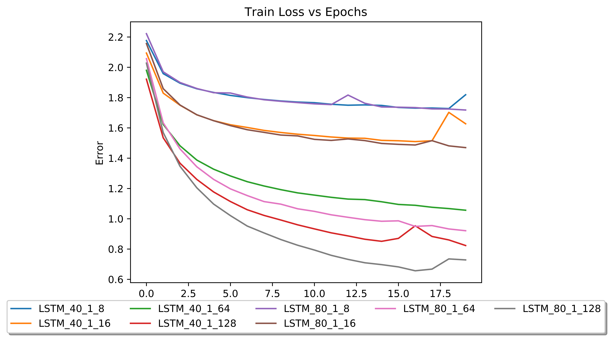
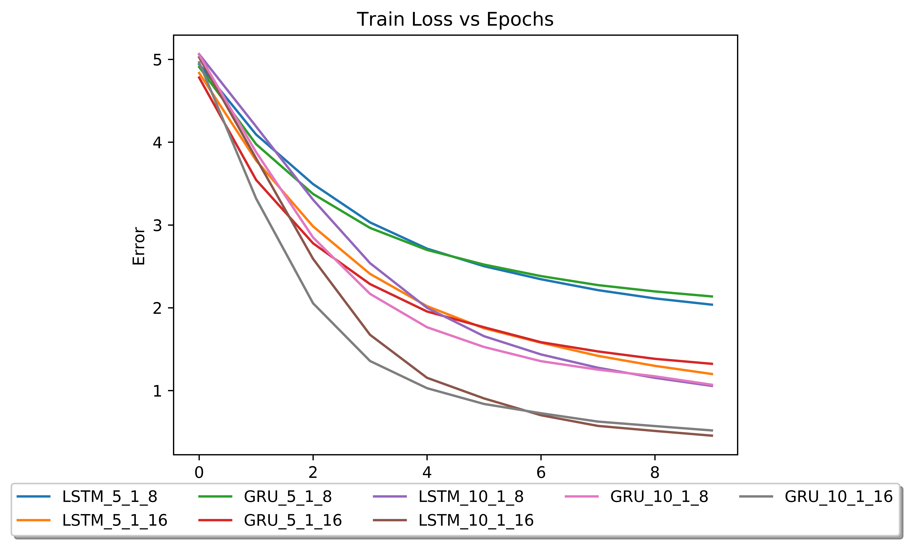

# Lyrics generator

## Table of Contents

<!-- vim-markdown-toc GFM -->

* [Introduction](#introduction)
    * [1. Motivation](#1-motivation)
    * [2. Dataset Preparation](#2-dataset-preparation)
        * [Data Preprocessing](#data-preprocessing)
* [Character-level recurrent neural network(RNN)](#character-level-recurrent-neural-networkrnn)
    * [1. How to prepare the data and train the model?](#1-how-to-prepare-the-data-and-train-the-model)
    * [2. How to generate lyrics?](#2-how-to-generate-lyrics)
    * [3. Lyric generator based on char-level RNN](#3-lyric-generator-based-on-char-level-RNN)
* [Word-level RNN](#word-level-rnn)
    * [1. Using the corpus vocabulary for one-hot-encoding](#1-using-the-corpus-vocabulary-for-one-hot-encoding)
    * [2. Lyric generator based on word-level RNN](#2-lyric-generator-based-on-word-level RNN)
* [Concluding remarks](#concluding-remarks)
* [Reference](#reference)
* [Acknowledgement](#acknowledgement)

<!-- vim-markdown-toc -->

## Introduction

### 1. Motivation

Natural language processing is among the most attractive and difficult field in machine learning. Different from computer vision and other machine learning tasks, NLP does not convey meaning through any physical manifestation. By the virtue of deep learning, NLP achieved tremendous progress in keyword search, machine translation, semantic analysis and etc. In this project, I would like to make a lyrics generator by using both character level and word level RNN(recurrent neural network).


Neural network
:-------------------------:
</img>

### 2. Dataset Preparation:
1. English: The dataset is from kaggle with lyrics from 55,000 songs

| index | lyrics                                            |
|-------|---------------------------------------------------|
| 0     | Look at her face, it's a wonderful face  \nAnd... |
| 1     | Take it easy with me, please  \nTouch me gentl... |
| 2     | I'll never know why I had to go  \nWhy I had t... |
| 3     | Making somebody happy is a question of give an... |
| 4     | Making somebody happy is a question of give an... |

1. Hindi-to-English translated: The dataset is obtained from internet via scraping

| index | lyrics                                            |
|-------|---------------------------------------------------|
| 0     | I broke and fell in Your arms in such a way\nL... |
| 1     | Woh oh oh oh\n \nIt's not easy, over here, to ... |
| 2     | You are my journey\nAnd you are my destination... |
| 3     | The girl of heart is in Egypt\n \nAt your serv... |
| 4     | Alright, I'm leaving now.\nPlease remember me ... |

We have used about 1000 songs from dataset 1 and 200 songs from dataset 2

#### Data Preprocessing
Corpus is created by concatenating all the songs. The data was noisy and unstructured. Some of the problems with the dataset:
1. Whenever a line is going to be repeated twice,  it is represented as ----2. This information is not very useful for our model. So we’ve removed such repetitions. It helps us in achieving our goal “To learn the style of how the corpus is written”.
2. Removing extra spaces, smileys, invalid punctuations like ‘@’, ‘#’ and digits etc.
3. Cleaning words with one-sided parentheses only.
4. Lastly changing each ‘\n’ to ‘ \n ’. Because of this step, we can treat newline character as a separate word. We are leaving the decision of starting new line to model itself.

## Character-level recurrent neural network(RNN)

Different approches based on LSTM and GRU were tried out as they are able to process sequences of inputs (such as words and sentences) by utilizing the internel state (memory state).


We have used Bi-directional LSTM and GRUs to learn the structure of the sentence before and after the word
Inspired by the [minimal character-level model](https://github.com/keras-team/keras/blob/master/examples/lstm_text_generation.py) from Keras team, we decided to build a more complicated RNN model to generate lyrics. Below is the summary of the best performing model:
```
Layer (type)                 Output Shape              Param #   
=================================================================
bidirectional_3 (Bidirection (None, 80, 128)           48640     
_________________________________________________________________
flatten_3 (Flatten)          (None, 10240)             0         
_________________________________________________________________
dropout_2 (Dropout)          (None, 10240)             0         
_________________________________________________________________
dense_3 (Dense)              (None, 29)                296989    
_________________________________________________________________
activation_3 (Activation)    (None, 29)                0         
=================================================================
Total params: 345,629
Trainable params: 345,629
Non-trainable params: 0
_________________________________________________________________
```


### 1. How to prepare the data and train the model?

* One-hot encode all characters ( a-z, 0-9 and punctuations ``` !"#$%&()*+,-./:;<=>?@[\\]^_`{|}~\t\n ``` )
    ```python

    [1,2,3] -> [[1,0,0], [0,1,0], [0,0,1]]
    ```
* Make a sliding window that collects 10 characters as input. Model only generates one character.
    ```
    input: 'hello, world' -> output: 'n', true output: 'p'
    ```
* Calculate cross entropy and backpropagate the neural network to update 568,687 parameters.
* Slide the window to the right by one character. Extract new input and iterate above process until cost function reaches the minimum.


### 2. How to generate lyrics?

* Make seed lyrics. Feed it to the neural network to generate one character after the seed lyrics, 'b'.
    ```
    input: 'I want to ' -> output 'b'
    ```
* Append new character to the seed lyrics and remove the very first character.
    ```
    new input : ' want to b'
    ```
* Feed the new seed lyrics into the neural network and iterate the above process as many as you want.
    ```
    'I want to ' -> ' want to b' -> 'want to be' -> .... -> 'ing of pop'
    ```
* In the end, you might get something like 'I want to be king of pop'


### 3. Lyric generator based on char-level RNN

After one epoch, generated lyrics:
```
input: ' heart its your fault my heart its your fault why did you trust himdo not love m'
output: 'are i thand sang love are ans and sane bacang in thas in thas thas and thas and ang an and in thang'
```
After 20 epochs, generated lyrics:
```
80 characters
input: 'bless waist doesnt listen to me when there is a beat playing i gotta shake it li'
output: 'bless waist doesnt listen to me when there is a beat playing i gotta shake it like the world of hor so so in my heart is ange this in on the beauting in the my someone in the songo'
```


## Word-level RNN

### 1. Using the corpus vocabulary for one hot encoding

Instead of letting the model learning how to spell words, we try a word-level model, by using a one-hot encoding approach across the corpus vocabulary. Correspondingly, this endows model the ability to learning semantics from the corpus.

```
_________________________________________________________________
Layer (type)                 Output Shape              Param #   
=================================================================
bidirectional_2 (Bidirection (None, 5, 32)             74496     
_________________________________________________________________
flatten_2 (Flatten)          (None, 160)               0         
_________________________________________________________________
dropout_2 (Dropout)          (None, 160)               0         
_________________________________________________________________
dense_2 (Dense)              (None, 564)               90804     
_________________________________________________________________
activation_2 (Activation)    (None, 564)               0         
=================================================================
Total params: 165,300
Trainable params: 165,300
Non-trainable params: 0
_________________________________________________________________
```
Training is much harder than character-base model. Training Loss curves for different architectures


### 2. Lyric generator based on word-level RNN

After 10 epochs:
```
10-word:
for a moment 
i want to become your bride of 

the was of the girls became the story 
brought the love is a very first decorate the world 

the seems as 
beloved 
we as well take you away 

the bride of badri 
```
## Concluding remarks

* Takeaways for tunning hyperparameters:
    ```
    1. It is easy to overfit the model. It is necessay to add Dropout layer after each LSTM layer.
    2. Sometimes GRU is better than LSTM and computationally cheaper.
    3. Initialization and luck are very important. Try to restart kernel if model is stuck at local minimum.
    ```
* Future work:
    ```
    1. Add embedding layer to make it more robust and corpus agnostic.
    ```


## Reference

1. [Keras team sample](https://github.com/keras-team/keras/blob/master/examples/lstm_text_generation.py)
2. [AI generates Taylor Swift songs](https://towardsdatascience.com/ai-generates-taylor-swifts-song-lyrics-6fd92a03ef7e)
3. [LSTM to generate songs](https://medium.com/coinmonks/word-level-lstm-text-generator-creating-automatic-song-lyrics-with-neural-networks-b8a1617104fb)
4. [Using an LSTM for Automatic Rap Lyric Generation](http://www.emnlp2015.org/proceedings/EMNLP/pdf/EMNLP221.pdf)
5. [Rap Lyric Generator](https://nlp.stanford.edu/courses/cs224n/2009/fp/5.pdf)


## Acknowledgement

* The above work is contributed by myself, Aman Joshi, Arpit Gupta and Shubham Pokhriyal.

* Dataset is from [Kaggle](https://www.kaggle.com/gyani95/380000-lyrics-from-metrolyrics).
